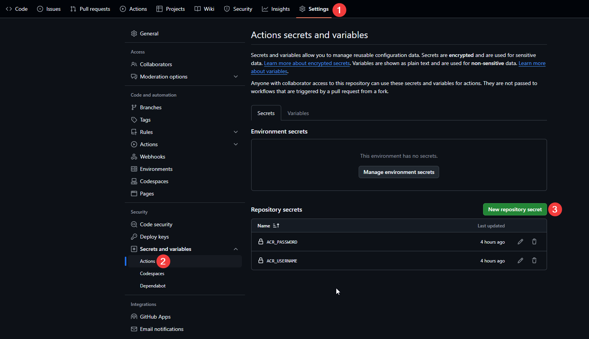

# actions
👋Hey! Welcome to my actions repository, where I save some of my commonly used GitHub Actions.

## Image Sync
This action is designed to synchronize Docker images in different image repositories through [AliyunContainerService/image-syncer](https://github.com/AliyunContainerService/image-syncer), and this Action will be started at 00:00 UTC every day and when there is a new push to the main branch.

The following are the files associated with this Action:
```
.github/
    workflows/
        image-sync.yml  # Workflow templates
image-sync/
    auth.yaml           # Docker image repository verification information
    images.yaml         # Map of source and target images
```
The names and locations of **auth.yaml** and **images.yaml** can be customized. Just replace auth_file and images_file in **image-sync.yml**:
```yaml
jobs:
    sync-images:
        with:
            auth_file: ./image-sync/auth.yaml           # The auth information file of registries, optional.
            images_file: ./image-sync/images.yaml       # The images file descirbes which images need to sync, always needed.
            version: latest                             # The version of image-syncer, use the latest version if not specified.
            proc: 6                                     # The max number of goroutines to sync images, default value is 5.
```
You need to enter the target registry's authentication information in auth.yaml (if the source registry also needs authentication, the source registry authentication information also needs to be entered), the best practice is to enter the authentication information into **Secrets**, then use it as env in **image-sync.yml**, and finally reference it in **auth.yaml** as **${XXX}**
```yaml
# image-sync.yml
jobs:
    sync-images:
      env:
        ACR_USERNAME: ${{ secrets.ACR_USERNAME }}
        ACR_PASSWORD: ${{ secrets.ACR_PASSWORD }}
# auth.yaml
registry.cn-hangzhou.aliyuncs.com:
  username: ${ACR_USERNAME}
  password: ${ACR_PASSWORD}
```


Image sync configuration file defines all the image sync rules. Each rule is a key/value pair, of which the key refers to "the source images url" and the value refers to "the destination images url". The source/destination images url is mostly the same with the url we use
in `docker pull/push` commands, but still something different in the "tags and digest" part:

1. Neither of the source images url and the destination images url should be empty.
2. If the source images url contains no tags or digest, all the tags of source repository will be synced.
3. The source images url can have more than one tags, which should be seperated by comma, only the specified tags will be synced.
4. The source images url can have at most one digest, and the destination images url should only have no digest or the same digest at the same time.
5. The "tags" part of source images url can be a regular expression which needs to have an additional prefix and suffix string `/`. All the tags of source repository that matches the regular expression will be synced. Multiple regular expressions is not supported.
6. If the destination images url has no digest or tags, it means the source images will keep the same tags or digest after being synced.
7. The destination images url can have more than one tags, the number of which must be the same with the tags in the source images url, then all the source images' tags will be changed to a new one (correspond from left to right).
8. The "destination images url" can also be an array, each of which follows the rules above.

```yaml
# If the source images url contains no tags or digest, all the tags of source repository will be synced.
quay.io/coreos/kube-rbac-proxy: quay.io/ruohe/kube-rbac-proxy
# The source images url can have more than one tags, which should be seperated by comma, only the specified tags will be synced.
quay.io/coreos/kube-rbac-proxy:v1.0: quay.io/ruohe/kube-rbac-proxy
quay.io/coreos/kube-rbac-proxy:v1.0,v2.0: quay.io/ruohe/kube-rbac-proxy
# The source images url can have at most one digest, and the destination images url should only have no digest or the same digest at the same time.
quay.io/coreos/kube-rbac-proxy@sha256:14b267eb38aa85fd12d0e168fffa2d8a6187ac53a14a0212b0d4fce8d729598c: quay.io/ruohe/kube-rbac-proxy
# The "destination images url" can also be an array, each of which follows the rules above.
quay.io/coreos/kube-rbac-proxy:v1.1:
  - quay.io/ruohe/kube-rbac-proxy1
  - quay.io/ruohe/kube-rbac-proxy2
```

You can find the example in [images.yaml](./image-sync/images.yaml).

